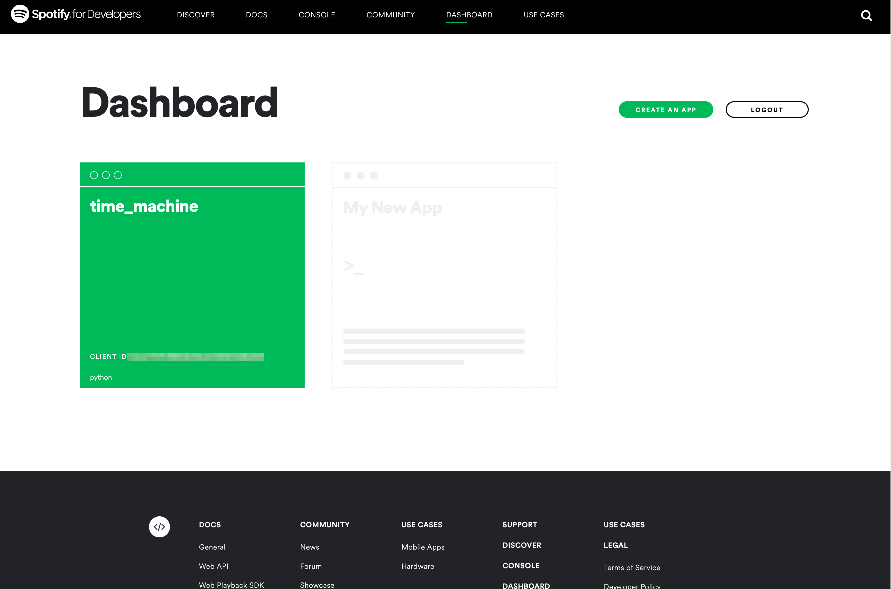

# Spotify Time Machine

This application uses BeautifulSoup to scrape Billboard's Top 100 songs for any given day, and creates a playlist in [Spotify](https://developer.spotify.com/dashboard/applications).

  <kbd>
    
  </kbd>

### Built with

- [Python 3.10](https://www.python.org/)
- [Beautiful Soup](https://beautiful-soup-4.readthedocs.io/en/latest/)
- [Spotipy](https://spotipy.readthedocs.io/en/2.19.0/)

## Getting started
1. Go to the [Spotify developer dashboard](https://developer.spotify.com/dashboard/applications) and create a new application. 
2. Copy the `client ID` and the `client secret` somewhere accessible. 
3. Under `edit settings`, add http://localhost:8888/callback as a Redirect URI. Copy this URI to somewhere accessbile.

### Install

Make sure Python 3.10 and the above libraries are installed.
You need to store a few environment variables:
* SPOTIPY_CLIENT_ID (copied from above)
* SPOTIPY_CLIENT_SECRET (copied from above)
* SPOTIPY_REDIRECT_URI (copied from above)
* USERNAME (your Spotify username, not the email address)

### Usage

Run the application. It will ask you to input a date in ISO format (YYYY-MM-DD). It will then scrape the Billboard Top 100 for that particular date, create a playlist and populate the playlist.
### Troubleshooting

This project is a work in progress. Please [report any issues](https://github.com/Seth-Scott/spotify-time-machine/issues) or submit a [pull request](https://github.com/Seth-Scott/spotify-time-machine/pulls).

### License

This project is licensed under the [MIT License](LICENSE.md).
